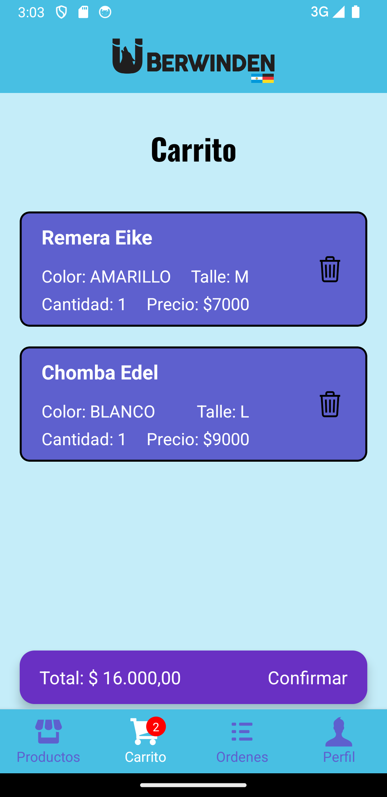

# Überwinden APP - Tienda de Ropa Deportiva

Este proyecto constituye la entrega final del curso de desarrollo de aplicaciones.

## Descripción

¡Bienvenido a Überwinden-APP! Esta es una aplicación exclusiva de comercio electrónico centrada en la venta de ropa deportiva de alta calidad. Experimenta la combinación perfecta de estilo, comodidad y rendimiento con nuestra amplia gama de productos diseñados pensando en atletas y entusiastas del fitness.

### Detalles de la APP

#### Acceso:

- El acceso a la aplicación solo es posible a través de la opción **Iniciar sesión**

    

- Si aún no tienes una cuenta, puedes crear una desde la opción **Registrate**
    
    

#### Navegación Inferior

- La navegación inferior consta de cuatro pestañas principales:

    - **Pestaña 1 - Productos:** Explora categorías, productos, realiza búsquedas por palabras clave y añade productos al Carrito de Compras.

         
        
        

    - **Pestaña 2 - Carrito:** Revisa los detalles de los productos en tu carrito y procede a generar la Orden de Compra.

        

    - **Pestaña 3 - Órdenes:** Consulta el historial de órdenes realizadas con detalles completos.

        
        

    - **Pestaña 4 - Perfil:** Accede a información del usuario, carga de imagen de perfil y cierra sesión cuando lo desees.

        
        

## Instalación

1. Clona el repositorio: `git clone https://github.com/mpicca83/Uberwinden-APP.git`
2. Instala las dependencias: `npm install`
3. Ejecuta la aplicación: `npm start`

© 2023, Mauricio Picca - Proyecto desarrollado como parte del curso de Desarrollo de Aplicaciones.